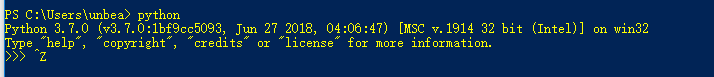
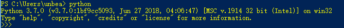
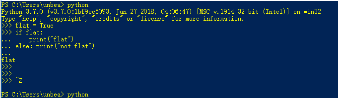

# 2. 使用 Python 解释器

## 2.1 调用解释器

* 在 linux 上， python 应该安装在 `/usr/local/bin` ，方便直接从 shell 调用 python。

* 在 windows 上，在安装时， 有勾选添加环境变量选项，所以可以安装在任何位置。 

  在 windows 上，若没有勾选添加环境变量选项可以在 dos 等命令行窗口可以使用命令，

  例如，你安装在 C:\python36

  > ```dos窗口
  > set path=%path%;C:\python36
  > ```

  

  在命令行进入 python ，可以直接键入 python, 例如:

  

  离开 python 命令行，在 windows 上可以键入 control + Z, 然后回车，在 linux 上可以键入 control + D.

  也可以使用函数 quit()。

  ### 2.1.1 参数解析

  先编写脚本, 取文件名为 sys.py

  ```python
  import sys
  
  for x in sys.argv:
      print(x)
  ```

  进入该脚本所在位置，运行指令 python sys.py - -c -x,如下图所示 

  

  ### 2.1.2 交互模式

  在 python 交互模式下, 以三个大于号开头，如图

  

  如果想要输入一个代码片段，例图

  

  

  ## 2.2 解释器和环境

  ### 2.2.1 源代码文件编码

  在写 python 脚本时，最好给脚本第一行声明脚本的字符编码，如指定脚本编码为 utf-8

  > ```python
  > # -*- coding: utf-8 -*-
  > ```

  这样就可以在脚本使用各种不同的语言，如 中文，日文，西班牙， 英文。

  指定其他编码将 utf-8 替换即可

  第一行指定脚本编码有个例外，如果想要脚本在 linux 上运行，这个脚本编码应该声明在第二行，例如

  ```python
  #!/usr/bin/env python3
  # -*- coding: utf-8 -*-
  ```

  每个脚本最好以这个代码段开头，这样既可以在 windows 上也可以在 linux 上运行。

  

