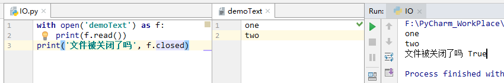
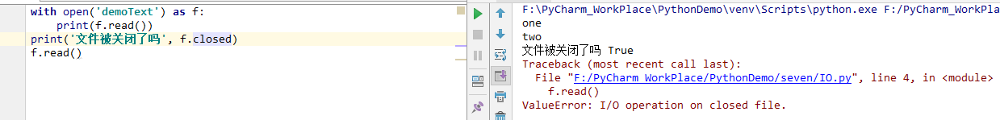

# 7. 输入和输出

## 7.2. 读写文件

[open()](./正在开发中.txt) 返回一个 [file object](./正在开发中.txt)，最常用的两个参数： open(filename, mode)

第一个参数是字符串类型，代表文件名。

第二个参数也是一个字符串，包含以下字符用于描述文件被使用的方式。

* 'r'  代表此文件只允许读。
* ‘w’ 代表此文件只允许写、如果文件名是一个已经存在的文件，那么此文件的内容会被擦除。
* ‘a’ 代表将要写的内容自动添加到文件末尾。
* ‘r+’ 代表此文件允许读和写。
* ‘b’ 代表此文件是二进制文件，可以读和写，但这个模式应保证文件里没有文本。

第二个参数是可选的，默认方式为 ‘r’， 且默认此文件为文本文件。除非第二个参数指定为 'b'。 如果未指定文件的编码方式，则文件以平台的编码方式打开。

Unix 行结尾符为 \n, Windows 平台行结尾符为 \r\n。

当以文本方式打开并读取到行结尾符时，会统一转化为 \n，写文件时 ‘\n’ 会自动转化为平台指定的行结尾符。这种在幕后修改文件数据对于文本方式没有影响。但会损坏二进制数据如 JPEG 或者 EXE 等文件。所以要非常小心对于二进制文件的读写。

当处理文件时，最佳实践是使用 with 关键字。使用 with 关键字的好处是当使用完这个文件后，这个文件会以恰当的方式关闭。甚至在执行代码时碰到异常这个文件也会关闭。而且代码更短比使用关键字 try-finally。

如果你没有使用 with 关键字，你在文件使用完成之后应调用 f.close() 来关闭文件，来释放系统资源。如果你没有调用 f.close()，python 垃圾收集器最终会关闭这个文件并摧毁这个对象，带来的代价是这个文件在没被垃圾收集器收集之前，这个文件会一直保持打开状态，且不同的垃圾收集器回收这个对象的时机不同。

当这个文件用 with 关键字或调用 f.close() 关闭这个文件后，再次尝试读取文件将会失败。

### 7.2.1 文件对象的方法

