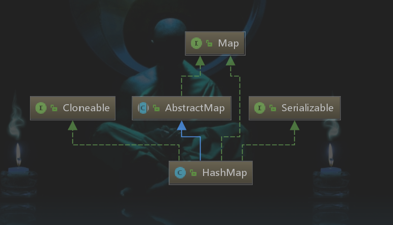

# Hashmap 全解析

如果给你一次机会来设计 HashMap，你会怎么设计？

## 类定义

hashmap 继承结构:



HashMap 类定义

```java
public class HashMap<K,V> extends AbstractMap<K,V>
    implements Map<K,V>, Cloneable, Serializable {
```

继承 AbstractMap, 实现 Map, Cloneable，Serializeble 接口。

AbstractMap 是一个抽象类，类定义：

```java
public abstract class AbstractMap<K,V> implements Map<K,V> 
```


## 内部类

### Node

```java
// 单向链表节点
static class Node<K,V> implements Map.Entry<K,V>{
    final int hash;
    final K key;
    V value;
    Node<K,V> next;
    // Objects.hashCode(Object obj) 方法：如果obj 不为空， 返回 0
    // 使用 entry 的 key 和 value 的 hashcode 混淆产生 entry 的 hashCode
    // Q: 为什么用 异或^ 混淆, 
    // A: 位运算有： ^, ~, |, &,>>, <<, >>>,  排除单目运算(~)
    //    继续排除 (|, &), 因为会导致计算的 hashCode 偏大或偏小，
    //    导致在数组的索引小部分或大部分冲突很大
    //    至于为什么不使用 移位运算，可能是因为不开心吧（不知道原因）。
    // 生成的 hashCode 运算后作为数组下标
    // Q: 为什么不直接使用Object 的 hashCode, 而要重写呢?
    // A: entry 的 hashCode 计算和 key, value 没有关系, 
    //    hashmap 中想要增加 hashCode 的独特性，所以增强了 hashCode 和 key 和 value 的相关性。
    public final int hashCode() {
        return Objects.hashCode(key) ^ Objects.hashCode(value);
    }
    
    // 先比较 this 和参数 o 的引用，相等就相等了
    // 如果引用不等，比较 key 和 value, 如果都相等，那么返回相等，否则不相等
    // Q: 为什么不使用上面的 hashCode 方法呢? 
    // A：hashCode方法有三个规范，其中之一就是，不相等的对象，可以有相同的 hashCode
    public final boolean equals(Object o) {
        if (o == this)
            return true;
        if (o instanceof Map.Entry) {
            Map.Entry<?,?> e = (Map.Entry<?,?>)o;
            if (Objects.equals(key, e.getKey()) &&
                Objects.equals(value, e.getValue()))
                return true;
        }
        return false;
    }
}
```


## 成员变量

```java
// 序列化 ID
private static final long serialVersionUID = 362498820763181265L;
// 默认数组初始大小
static final int DEFAULT_INITIAL_CAPACITY = 1 << 4;
// 数组最大容量
// Q：为什么数组最大容量是 1<<30,
// A：java 只有 有符号数（即int 最高为表示负数），
// 且 hashcode 算出值是 与运算 求数组下标，且数组扩大是 2 倍扩大
static final int MAXIMUM_CAPACITY = 1 << 30;
// 负载因子，arr 表示数组, 即数组元素被占用 arr.length * DEFAULT_LOAD_FACTOR 就扩容
static final float DEFAULT_LOAD_FACTOR = 0.75f;
// 链表长度达到 8 就转化为红黑树
static final int TREEIFY_THRESHOLD = 8;
// 当红黑树中的元素少于 6 就转化成链表
// Q：为什么要转换成链表，树查找效率不是更高吗?
// A: 虽然查找效率高，但红黑树删除元素的过程是非常复杂的，
// 且元素数量少，链表查找和红黑树查找性能差距体现不出来
static final int UNTREEIFY_THRESHOLD = 6;

static final int MIN_TREEIFY_CAPACITY = 64;

```


## 方法

```
// hash 方法, 高 16 位与低 16 位异或， 高 16 位不变
// Q：为什么要将高 16 位的 向下移动？
// A：因为 采用 与运算就数组下标，在数组长度没扩大到一定程度时，即 65536 以下时
//   如不移动，数组下标只和低位 hashCode 值有关，
//   为了在数组长度小于 65536 时，高位 hashCode 也能产生作用，所以移位
static final int hash(Object key) {
    int h;
    return (key == null) ? 0 : (h = key.hashCode()) ^ (h >>> 16);
}
```

