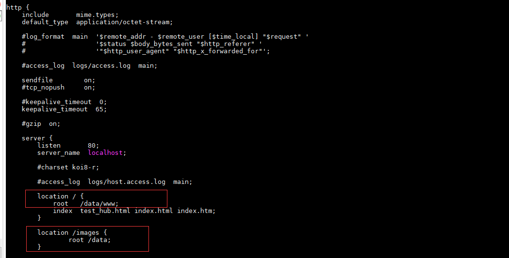
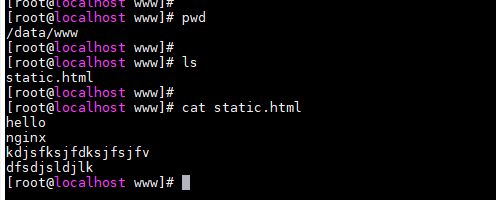
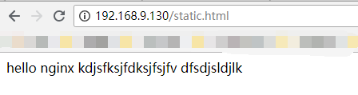
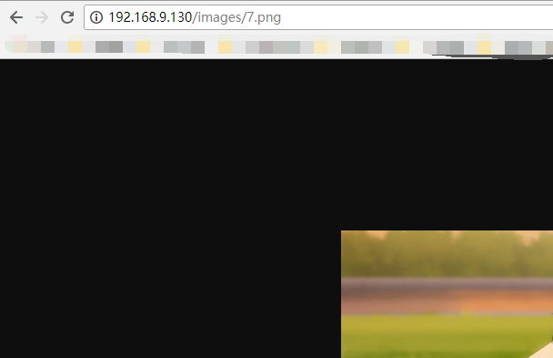
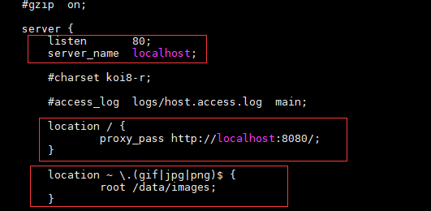
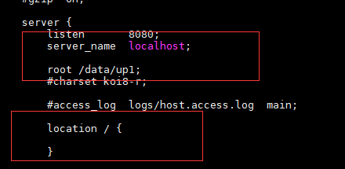

# nginx 初始指南

网上看了一些资料，也翻了一些书，但一直没有找到适合我的学习资料。

So: 我决定还是老老实实看官方文档吧。

这里做个记录，开始！

觉得还不错的 nginx 资料:

http://www.nginx.cn/

http://www.nginx.cn/nginx-how-to


该作者写了三篇 nginx 的使用文档，可以根据文章练习 nginx。

https://juejin.im/user/5901f6125c497d00582509e3/posts

## 开始停止 nginx

启动 nginx :

直接找到 nginx 安装目录下的 sbin/nginx 直接启动。

当 nginx 启动后，可以使用信号去控制 nginx

```
nginx -s signal
```

其中 signal 的取值:

* `stop`  快速停止 
* `quit` 优雅停止
* `reload` 重新加载配置文件
* `reopen` 重新打开配置文件

停止nginx 完整命令示例:

```
nginx -s quit
```

重点提一下 reload 这个型号量，这个信号量实现了 nginx 的热加载，即不用重启 nginx 即可更新配置文件

```
nginx -s reload 
// 另一个热加载命令
kill -hup nginx进程号
```

当 nginx 主进程 master 收到热加载命令，会首先检查配置文件是否符合语法规则。

若符合，master 发送命令给旧的配置文件生成的worker ，让旧 worker 不在接受新的请求，同时处理完目前已经收到的请求就关闭。同时生成新的 worker，来服务新的请求。

若配置文件错误，master 进程就进行回滚，依旧使用老的配置文件。

发现热加载时，master 进程会检查配置文件, 其实我们可以手动检查配置文件。

```
nginx -t 配置文件路径
```

## nginx 作为静态服务器

首先需要修改配置文件，映射本地资源目录。配置文件是 nginx 安装目录下的 `nginx.conf`配置文件。

在 nginx.conf 文件中的 http 配置块中配置。整体结构如下：

```
http{
    server {
        location / {
            root /data/www;
        }
        location /images/ {
            root /data;
        }
	}
}
```

以上配置的解释：

映射网站根目录为系统 /data/www/

映射网站图片目录为 /data/images/

实际配置图:



html 文件查看：

输入网址得到结果:



图片资源查看:


浏览器中访问图片网址：http://192.168.9.130/images/7.png



从这个简单例子，介绍一下 nginx.conf 中 location 配置：

```
location / {
	root /data/www;
}
location /images/ {
	root /data;
}
```

在这个配置中，`/images/` 是 `/`  的子路径，当uri 以 /images/abc, 那么 nginx 就会匹配 root 为 /data 的配置。

如果 uri 为 /kskk/sss, 那么 nginx 就会匹配到 root 为 / 的配置上去，就会去 www 目录下寻找。

nginx 遵循匹配越多，就选哪个配置的原则。同时会将 url 剩余部分添加上去。

注意：配置完成后需要重新加载配置文件。

```
nginx -s reload
```

如果配置没成功，可以查看 nginx 安装目录下的 logs 文件夹中的 acess.log 和 error.log。

## nginx 作为正向代理服务器

nginx 指定配置文件启动:

```
nginx -c 配置文件位置
```

配置代理服务器：



配置含义:

```
listen 80; // 服务器监听80端口
proxy_pass http://localhost:8080/; // 指出被代理服务器的协议http, 和端口 8080。
其中两个location 的含义是如果用户输入的 url 是以 gif或jpg或png 结尾，那么就访问本地 /data/images 下的文件，不将请求转发给 http://localhost:8080/
```

配置被代理的服务器:



测试：访问 url: http://192.168.9.130/7.png 能成功访问图片。

访问 url: http://192.168.9.130/up1.html 能成功查看 up1.html，即配置成功。


